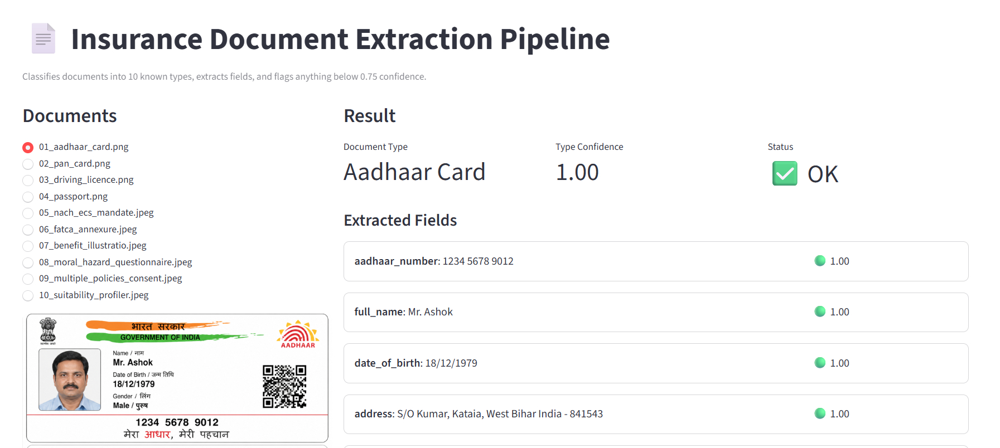
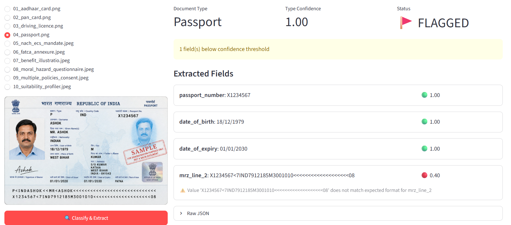

# Document Classification & Extraction Pipeline

Classifies 10 insurance/identity document types, extracts required fields,
scores confidence per field, and flags anything below threshold for human
review.

## Project structure

```
doc_extraction_pipeline/
├── documents/                          # the 10 target docs + 2 extra out-of-scope docs
│   ├── 01_aadhaar_card.png
│   ├── 02_pan_card.png
│   ├── 03_driving_licence.png
│   ├── 04_passport.png
│   ├── 05_nach_ecs_mandate.jpeg        # handwritten
│   ├── 06_fatca_annexure.jpeg          # handwritten
│   ├── 07_benefit_illustration.jpeg    # handwritten
│   ├── 08_moral_hazard_questionnaire.jpeg  # handwritten
│   ├── 09_multiple_policies_consent.jpeg   # handwritten
│   ├── 10_suitability_profiler.jpeg    # handwritten
│   ├── 11_extra_proposal_form.pdf      # NOT one of the 10 types - deliberately out of scope
│   └── 12_extra_assignment_form.pdf    # NOT one of the 10 types - deliberately out of scope
├── schemas.py               # field list + regex validator per document type, confidence threshold
├── pipeline.py               # classify + extract (Gemini vision) + format validation + scoring
├── run_pipeline.py            # orchestrates: loops over documents/, saves JSON + flag report
├── ground_truth_reference.json  # values I read by eye - use this to sanity-check accuracy
├── requirements.txt
└── output/                   # generated after running - one JSON per doc + flagging report
```

## Setup

```bash
pip install -r requirements.txt
```

Get a free key at aistudio.google.com (sign in with any Google account ->
"Get API key" -> Create key, no billing setup needed). Create a `.env` file
in this folder:
```
GOOGLE_API_KEY=your_key_here
```

## Run

```bash
python3 run_pipeline.py
```

This processes all 10 image documents (the 2 PDFs are intentionally skipped -
see below), printing progress, then writes:
- `output/<filename>.json` - full structured result per document
- `output/flagging_report.json` / `.md` - everything that needs human review, in one place

Compare against `ground_truth_reference.json` to check real-world accuracy.

## Screenshots




## How classification + extraction works

Each document image is sent to Gemini once, with a single prompt listing all
10 known types and their required fields. The model classifies the document
AND extracts its fields in the same call (instead of two separate calls) -
this is simpler and gives the model the full document context for both
decisions at once, since it has to "look" at the layout regardless.

For each field, the model returns:
- `value` - the extracted text (or null if not found/illegible)
- `confidence` - the model's own honest confidence (0-1)
- `legible` - whether the source text was actually readable, independent of whether it guessed a value anyway

## Confidence scoring (per field, not just per document)

Two layers combine into the final confidence:
1. **Model self-reported confidence** - asked explicitly to be conservative,
   especially on handwriting/ambiguous characters.
2. **Format validation** - any field with a checkable pattern (Aadhaar
   number, PAN, IFSC code, dates, MRZ line, etc.) is regex-checked against
   its expected format. If the value doesn't match, confidence is capped at
   0.4 regardless of what the model claimed - this catches the dangerous
   case of a confidently wrong answer, not just a visibly uncertain one.

Free-text fields (names, places, reasons) have no regex - their score is the
model's self-reported confidence alone, since there's no independent way to
validate prose.

## Confidence threshold: 0.75 (and why)

This is insurance onboarding data - a wrong IFSC code or bank account number
that gets silently accepted can misroute real money; a wrong identity number
can cause a compliance failure. The cost of a false negative (flagging
something that was actually fine) is a few minutes of human review. The cost
of a false positive (auto-accepting a wrong value) is a financial or
compliance error. Given that asymmetry, the pipeline deliberately biases
toward recall over precision - flag generously rather than risk a silent
wrong value - so the threshold is set fairly high at 0.75 rather than, say,
0.5.

## How handwritten text is handled differently from printed text

There's no separate code path for handwriting - both go through the same
Gemini vision call - but the prompt explicitly tells the model to be more
conservative on handwritten/cursive text and on visually ambiguous characters
(0 vs O, 1 vs 7, 5 vs S). The real differentiator is downstream: every
handwritten document type is tagged `is_handwritten_type: true` in the
output, so a human reviewer can immediately filter to "documents where
extraction is inherently less reliable" even before looking at individual
confidence scores. Combined with the regex-based format validation (which
catches confidently-wrong values regardless of source), this gives two
independent signals rather than relying purely on the model's own self-rated
confidence for the hardest fields.

## Expected failure cases (based on direct visual review of these documents)

- 06_fatca_annexure.jpeg - TIN/PAN field: the handwritten value reads as
  "BPQPD3051R" but several characters are written in a way that could be
  misread digit-for-letter (0 vs O, 5 vs S) - a likely realistic failure
  point even for a strong vision model.
- 05_nach_ecs_mandate.jpeg - bank account number: long handwritten digit
  strings are the single highest-risk field type in the whole set - one
  misread digit changes the entire account number with no format signal to
  catch it (any 11-digit string "looks" valid).
- 11_extra_proposal_form.pdf / 12_extra_assignment_form.pdf: these are real
  HDFC Life documents but are NOT one of your 10 required types (a
  Proposal/Application Form and an Assignment Request Form). The pipeline
  currently skips PDFs entirely rather than misclassifying them - a more
  complete version would convert PDF pages to images first and let the
  classifier correctly return "unsupported" for them, which is arguably a
  better demonstration of robustness than simply excluding them. Worth
  mentioning in the interview as a known limitation you're aware of, not
  something you missed.
